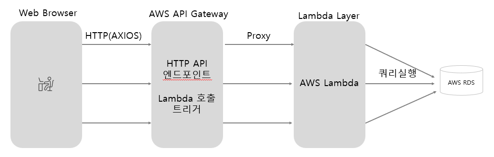

# READ ME

본 프로젝트는 이산사건 시뮬레이션기반 APS(Advanced Planning & Scheduling) 시스템의 토이프로젝트입니다. 가상의 반도체 PHOTO 공정의 생산 계획을 세우는 걸 목표로 합니다.
사용자가 조작하는 UI와 실제 계획을 세우는 응용프로그램으로 나누어져 있습니다.

프로젝트 소개 PDF : [https://drive.google.com/file/d/1dcblyFfFAxLis_7fcvOaT5kK6Gou6-Cp/view?usp=sharing](https://drive.google.com/file/d/1dcblyFfFAxLis_7fcvOaT5kK6Gou6-Cp/view?usp=sharing) 

WEB UI : [http://52.79.235.205:88/](http://52.79.235.205:88/)

- WEB UI에서 엔진 실행 가능

아래에는 인프라 구성, 코드 레벨의 프로젝트 구조, 객체나 함수의 역할 등에 대해 기술하겠습니다.

# APS 프로젝트 구성 및 Work Flow

# 1. 시뮬레이션

# **1.1 Data Mart**

C#, .Net Framework 4.7, Library

: 데이터 ETL을 위한 모듈입니다.  

## Input Mart

: 시뮬레이션시 사용할 Input 데이터를 정의하여 사용합니다. DB로 부터 입력 받고 데이터 유효성 검사 등을 하여, 시뮬레이션 전 데이터 전처리를 할 수 있습니다.

## Output Mart

: 시뮬레이션을 진행하면서 각종 통계 정보를 Output Mart에 수집합니다. 수집한 Output Mart는 엔진 종료시 DB에 INSERT 합니다.

# **1.2 Simulation Engine**

C#, .Net Framework 4.7, Library

: 시뮬레이션 엔진은 확장성과 재사용성을 고려한 모듈식 구조로 설계되어 다양한 공정 환경에 유연하게 적용될 수 있습니다.

## 주요 구성 요소

- **Base Entity:** 엔진에서 관리되는 기본 데이터 (모델에서 필수 구현 필요)
  - Equipment, Lot, Process, Product, Step
- **Simulation Entity:** Simulation 시 발생하는 추가 정보들 처리. Base Entity를 wrapping하여 사용
  - SimFactory : 시뮬레이션의 가장 상위 계층을 가지는 객체. Manager객체를 모두 가지고 있다.
  - SimEquipment, SimLot : 시뮬레이션 진행 중 동적인 상태 변화, 계획 정보 등을 가지게 되는 객체.
- **Manager Layer**: 설비, 작업물, 공정 등 주요 객체의 행동 관리
  - Schedule Manager: 이벤트 큐 관리 및 시간 진행 제어
  - Route Manager: 작업물의 공정 흐름 제어
  - Equipment Manager: 장비의 상태 변화 및 작업 수행 관리
  - Lot Manager: 작업물의 상태 관리
  - Process Manager: 공정 및 SETUP 작업의 시작/종료 처리
  - Offtime Manager: 유휴시간 관리
  - Dispatching Manager: 설비-작업물 매칭 관리
- **Simulation Interface:** 업종, 공장에 따라 모델에서 구현해야 하는 로직에 대한 인터페이스 제공

## 핵심 기능

- **이벤트 기반 시간 관리**: 다음 이벤트 시점으로 시간을 도약시켜 효율적 시뮬레이션
- **동적 상태 변화**: 이벤트 발생에 따른 객체 상태 변화 처리
- **병렬 처리**: 동시에 발생하는 여러 이벤트의 적절한 처리

## 아키텍쳐의 설계 아이디어

- **SimFactory를 통한 중앙 관리**
  - SimFactory가 다양한 Manager들을 중앙 관리
  - 각 Manager가 직접 다른 Manager를 생성하지 않고 Factory를 통해 접근
- **인터페이스 기반 설계**
  - IEquipmentModel, ILotModel 등 인터페이스를 통해 모델과 엔진 분리
  - 구체적인 구현체(PhotoEquipmentModel 등)보다 인터페이스에 의존
- **Model 주입 방식**
  - Manager들이 Model 인터페이스를 생성자를 통해 주입받음
  - 의존성이 외부에서 제공됨

# 1.3 Photo Aps Model

C#, .Net Framework 4.7, 콘솔 앱

: 반도체 공장의 시뮬레이션 대상 요소 추출 및 커스텀 로직 구현. 로컬에서 디버깅 가능한 콘솔 앱.

## 주요 모델링 요소

- LOT 20개
- 제품 2개
- 공정 : 접착제 도포(HMDS), 감광제 도포(PR), 노광(EXPOSURE), 현상(DEVELOPING), 검사(INSPECTION)
- 설비: 접착제 도포 3대, 감광제 도포 3대, 노광 3대, 현상 2대, 검사 2대

## 기타 커스텀 로직 구현

- 노광(EXPOSURE) 공정의 SETUP
- 일요일 마다 OFF 발생

# 1.4 Engine Trigger

C#, .ASP .NET CORE

: 웹에서 엔진을 실행시키기 위한 End Point. HTTP로 호출하면 엔진을 실행시킬 수 있다.

# 2. WEB UI

: 기준정보 확인, 엔진 실행, 생산 계획 결과 분석 기능을 제공하는 WEB UI

AWS Lambda를 사용한 Serverless 아키텍쳐

## Frontend

AWS EC2(Window Server, IIS), Vue3(typescript), Quasar(오픈소스 디자인 컴포넌트)

## Backend

AWS Lamdbda (Node.js), API Gateway

## DB

AWS RDS(My Sql)
